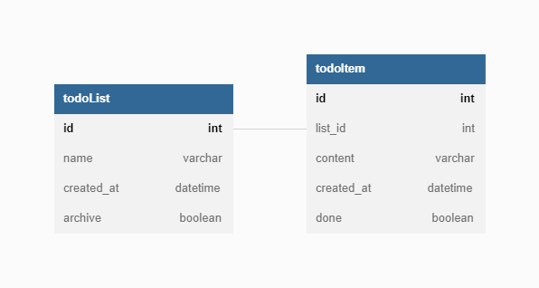

# Petpaw TODO app exam instruction

## Software Technical Spec
### Frontend
 - ReactJS หรือ NextJS
 - Typescript
 - สามารถใช้ CSS helper, CSS framework หรือ UI Framework ได้
 - source code ทั้งหมดต้องถูกจัดเก็บและบริหารจัดการผ่าน Git Repository

### Backend
 - Nest.JS
 - TypeORM
 - source code ทั้งหมดต้องถูกจัดเก็บและบริหารจัดการผ่าน Git Repository

## Software Requirement Spec
ต้องการ App Todo list ที่สามารถใช้ได้ผ่าน website 

สิ่งที่ Software ต้องทำได้
 - สามารถ สร้าง List ได้หลาย List
 - สามารถ ลบ List ได้
 - สามารถ archive List ได้
 - สามารถ สร้าง รายการใน List ได้
 - สามารถ ลบ รายการใน List ได้
 - สามารถ mark done รายการใน List ได้
 - ข้อมูลทั้งหมดต้องเก็บลงฐานข้อมูลอย่างถูกต้องตามหลักของประเภทฐานข้อมูลที่เลือกใช้

## UI Specification
สามารถออกแบบและพัฒนาหน้าตาของ website เองได้แต่แนะนำให้เลียนแบบ web อื่น ๆ เช่น [todoist](https://todoist.com/) [any.do](https://www.any.do/)

## API Specification
ให้พัฒนา web service api ตาม spec ใน link ด้านล่าง

[API Specification](./api/README.md)

## Database Specification
database สามารถใช้ database ได้ทุกประเภท โดยให้สร้างฐานข้อมูลอ้างอิงตาม ER Diagram

more detail: https://dbdocs.io/users/TodoList?view=relationships

Database service ที่แนะนำ
 - https://www.filess.io/

## Deployment (optional)
### Front end

สามารถ deploy โดยวิธีใดก็ได้

platform ที่แนะนำ

 - firebase hosting
 - https://www.netlify.com/
 - https://vercel.com/
 - https://fly.io/

### Backend

สามารถ deploy โดยวิธีใดก็ได้

platform ที่แนะนำ

- https://fly.io/
- https://render.com/
- https://www.heroku.com/

## Remark

 - การส่งงานให้ทำการส่ง link ของ git repository ทั้ง Frontend และ Backend
 - สามารถส่ง link ของ website ที่ deploy เสร็จแล้วได้ โดยต้องทำงานร่วมกันกับ Backend และฐานข้อมูล (ไม่บังคับ)